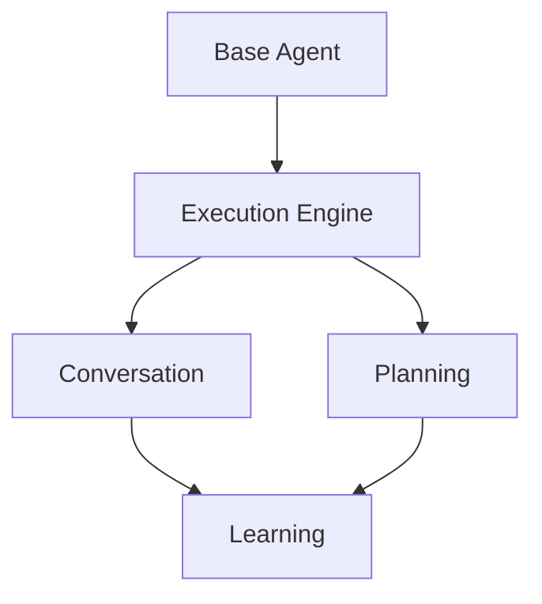

# Feature Model

## Overview

The feature model in AgentSPL defines the available capabilities and their relationships.

## Feature Categories

### 1. Core Features

- **Base Agent**
  - Event System
  - State Management
  - Communication
  
- **Execution Engine**
  - Task Scheduling
  - Resource Management
  - Error Handling

### 2. Cognitive Features

- **Conversation**
  - Natural Language Processing
  - Dialog Management
  - Context Tracking
  
- **Planning**
  - Goal Management
  - Action Planning
  - Plan Execution
  
- **Learning**
  - Model Training
  - Experience Collection
  - Adaptation

### 3. Integration Features

- **API Connectors**
  - REST APIs
  - WebSocket
  - GraphQL
  
- **Storage**
  - Memory Storage
  - Persistent Storage
  - Distributed Storage

## Feature Dependencies



## Configuration Examples

### Minimal Agent
```javascript
{
  "features": {
    "baseAgent": true,
    "executionEngine": true
  }
}
```

### Full-Featured Agent
```javascript
{
  "features": {
    "baseAgent": true,
    "executionEngine": true,
    "conversation": true,
    "planning": true,
    "learning": true
  }
}
```